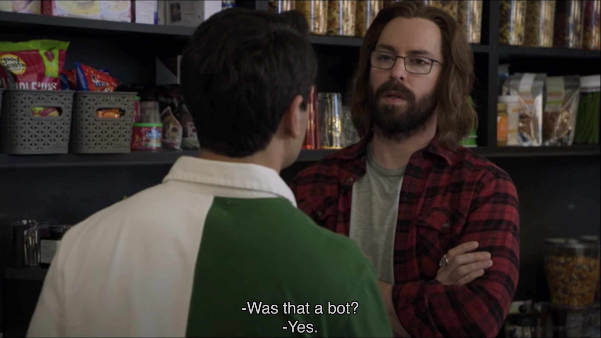

# Texts AI
Generates texts using an LLM fine-tuned on previous messages.



## Getting started
1. Run `pip install -r requirements.txt`
2. Follow instructions below to initialize a model if needed
3. Run `python3 texts_ai.py --help` for instructions

## Setting up language models
Both *GPT*-type and *LLaMa*-type models are supported. I wrote the prompts and **query.py** to correspond with [Vicuna](https://huggingface.co/lmsys/vicuna-13b-delta-v1.1), for *LLaMa*-type models, and a custom [NanoGPT](https://github.com/karpathy/nanoGPT) for *GPT*-type models. Instructions to configure both of them are below, but the code should be hackable to work with a variety of models.
<details><summary><b>Fine-tuning with NanoGPT</b></summary>

1. Clone `karpathy/nanoGPT`
2. Run **training_messages.py** from this repo
3. Edit `nanoGPT/data/shakespeare/prepare.py` to use the file written by **query.py** rather than Shakespeare
4. Run **prepare.py**
5. Follow the instructions from NanoGPT to fine-tune or train using the `train.bin` and `val.bin` files created by **prepare.py**

</details>
<details><summary><b>Setting up Vicuna</b></summary>

1. Run `brew install bash`
2. Download **llama.sh** from [this repo](https://github.com/shawwn/llama-dl)
3. Modify **llama.sh** to only download 7B and then run it with homebrew's bash
4. Convert to Tokenizer format using [this script](https://github.com/huggingface/transformers/blob/main/src/transformers/models/llama/convert_llama_weights_to_hf.py) and this command:
```
python src/transformers/models/llama/convert_llama_weights_to_hf.py \
  --input_dir /path/to/downloaded/llama/weights \
  --model_size 7B \
  --output_dir /output/path
```
3. Modify LLaMa with Vicuna weights:
```
python3 -m fastchat.model.apply_delta \
  --base-model-path /path/to/llama-7b \
  --target-model-path /path/to/output/vicuna-7b \
  --delta-path lmsys/vicuna-7b-delta-v1.1 \
  --low-cpu-mem
```
4. Run blocks 2 and 3 of [this script](https://github.com/taiyou2000/alpaca-convert-colab/blob/main/alpaca-convert-colab-fixed.ipynb) on the Vicuna bin, replacing `LLaMa` with `Llama`
5. Run conversion scripts from [llama.cpp](https://github.com/ggerganov/llama.cpp) to convert Vicuna *pth* to *f16* and then *q4_0*

</details>

## Helpful resources
- [NanoGPT](https://github.com/karpathy/nanoGPT)
- [Running nanoGPT on a MacBook M2](https://til.simonwillison.net/llms/nanogpt-shakespeare-m2)

## License
Under the [MIT License](https://github.com/ravibrock/texts-ai/blob/main/LICENSE). Models may have their own licenses.
